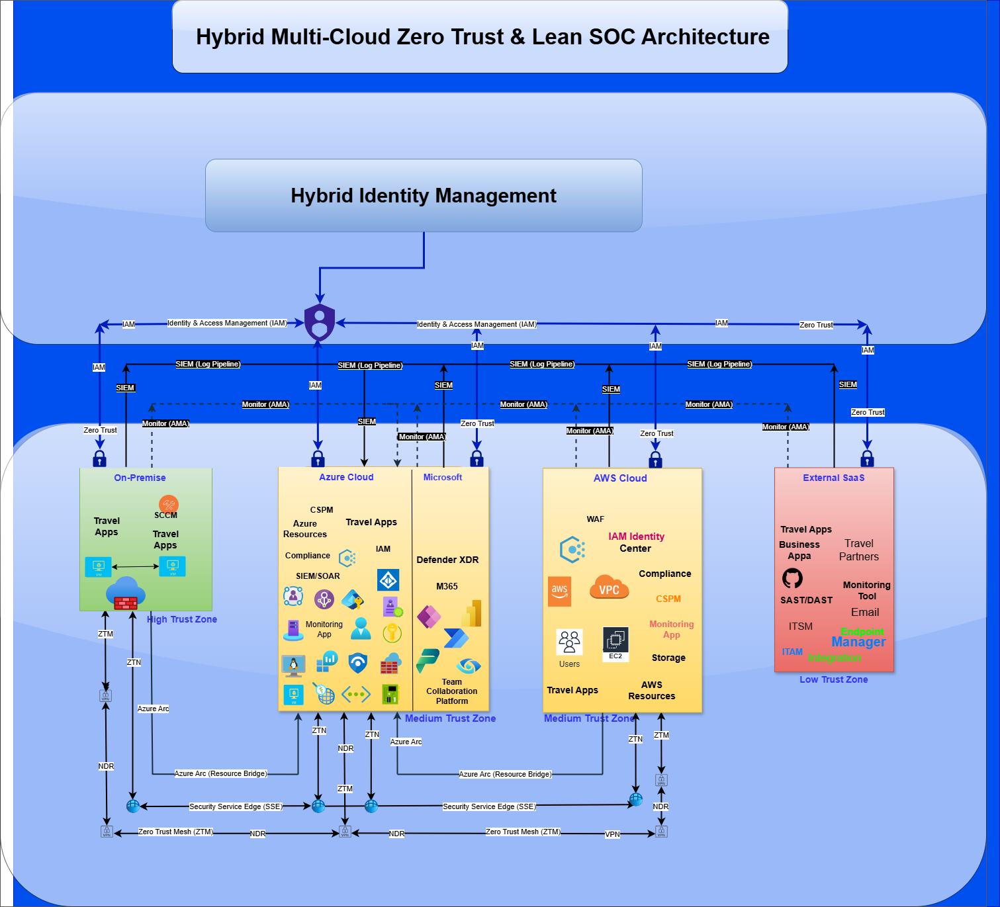
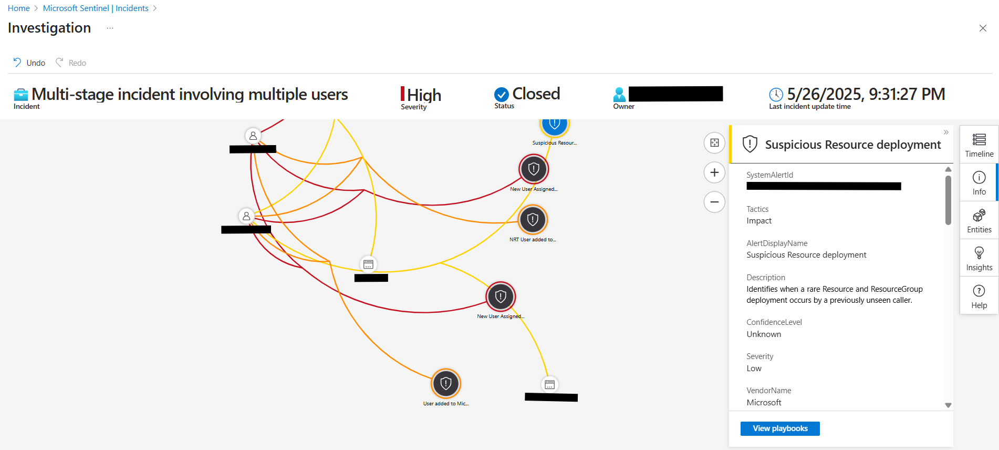
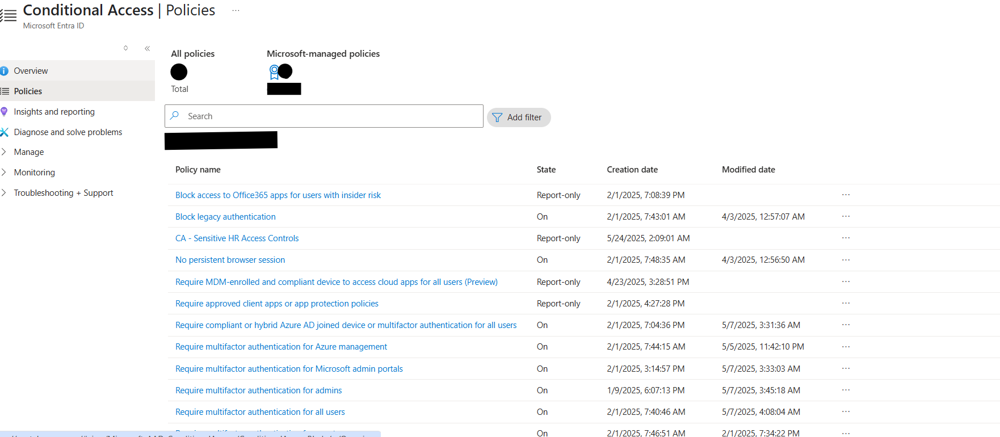
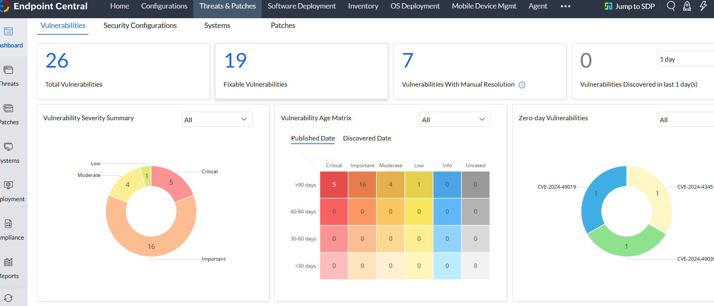

# 🔐 Hybrid Multi-Cloud Zero Trust Architecture


Welcome to my cybersecurity engineering showcase—a real-world hybrid multi-cloud architecture I designed and implemented using Zero Trust principles across On-Prem, Azure, AWS, and SaaS ecosystem.  The design integrates identity, access control, monitoring, and secure remote access across cloud, on-premises, and SaaS environments.

---

## 🌐 Overview

This repository demonstrates how I built and secured a hybrid infrastructure spanning:

- 🏢 On-Premises  
- ☁️ Azure & AWS Cloud  
- 🧩 SaaS Platforms  

The architecture follows Zero Trust principles — ensuring **continuous identity verification**, **least privilege**, and **context-based access** across environments.

---

## 🧩 Architecture Diagram

🔽 Sanitized visual of the high-level architecture:



---

## 🛡️ Security Highlights

- ✅ Hybrid identity and access control with **Microsoft Entra ID**, AWS IdentityCenter, AD
- ✅ Zero Trust Network Access using **Netbird VPN** + **Microsoft Global Secure Access**
- ✅ **Unified Endpoint Management** via Endpoint Central, integrated with Azure AD
- ✅ **SIEM integrations**: Microsoft Sentinel,AWS SecurityHub, AWS CloudWatch, Azure Monitor 
- ✅ **Conditional Access** for trusted zones and role-based access
- ✅ **TLS 1.2**, **disk encryption**, and **VPN-enforced SSO**

---

## 📸 SecOps in Action

| Description                                | Screenshot                                               |
|--------------------------------------------|------------------------------------------------          |
| 🔎 Privilege escalation alert investigation|            |
| 📦 Suspicious resource deployment          |  |
| 🎯 Conditional Access Policy enforcement(80% Score)|    |
| 🖥️ Device monitoring in Endpoint Central   |               |
| 📊 SIEM log correlation in Microsoft Sentinel |                |

> All screenshots are real, redacted, and timestamped. No identifying or sensitive data is shown.

---

## 🧰 Tooling Stack

| Category             | Tools / Platforms                                            |
|----------------------|--------------------------------------------------------------|
| Identity & Access    | Microsoft Entra ID, Azure AD, SCIM, MFA, SSO                 |
| Zero Trust Network   | Netbird VPN, Microsoft Global Secure Access (GSA)            |
| Cloud Infrastructure | Azure, AWS (IAM, EC2, CloudWatch)                            |
| Endpoint & UEM       | Zoho Endpoint Central, integrated with Azure AD              |
| SIEM & Monitoring    | Microsoft Sentinel, Azure Monitor, Site24x7, CloudWatch     |
| Compliance & Audit   | Defender for Cloud, AWS Security Hub, Log360                 |

---

## 🧠 Future Enhancements

- 📦 Terraform Infrastructure-as-Code modules (part of my ObsidianWall platform initiative)
- 🛠️ Python-based CLI toolkit for security auditing (Entra ID, AWS, logs)
- 📊 Zero Trust rollout tracker / scorecard
- ✅ Compliance control matrix to map implementation to frameworks (NIST, CIS, ISO)

---

## 📁 Repository Contents
## 📁 Repository Contents

```
├── assets/           # Diagrams and redacted screenshots
├── scripts/          # Optional Python automation scripts
├── policies/         # Optional Conditional Access policy exports
├── README.md         # This file
└── LICENSE
```

---

## 🚀 Why This Project?

This project represents real-world cybersecurity engineering work:  
✅ Hands-on with modern hybrid security stacks  
✅ Built using Zero Trust principles  
✅ Demonstrates SecOps, IAM, and cloud infrastructure security in action

---

> 🧭 Want to see this in action or talk shop? Let’s connect on [LinkedIn](https://linkedin.com/in/aisha-3136031a0i) or [GitHub Discussions](https://github.com)!
