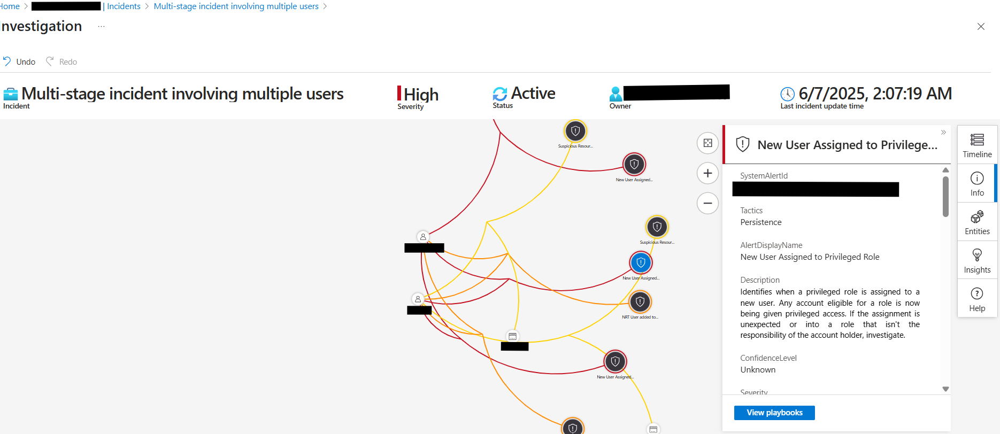
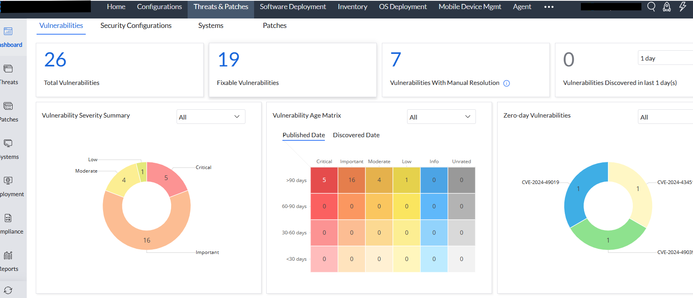

# 🔐 Hybrid Multi-Cloud Zero Trust Architecture


Welcome to my cybersecurity engineering showcase—a real-world hybrid multi-cloud architecture I designed and implemented using Zero Trust principles across On-Prem, Azure, AWS, and SaaS ecosystem.  The design integrates identity, access control, monitoring, and secure remote access across cloud, on-premises, and SaaS environments.

---

## 🌐 Overview

This repository demonstrates how I built and secured a hybrid infrastructure spanning:

- 🏢 On-Premises  
- ☁️ Azure & AWS Cloud  
- 🧩 SaaS Platforms  

The architecture follows Zero Trust principles — ensuring **continuous identity verification**, **least privilege**, and **context-based access** across environments.

---

## 🧩 Architecture Diagram

🔽 Sanitized visual of the high-level architecture:


## 🧭 Architecture Breakdown & Data Flow

🧩 Architecture Components Explained

This architecture enforces Zero Trust principles across a hybrid, multi-cloud ecosystem, integrating identity, access, monitoring, and secure access controls. Here's how the components interact:

|Zone / Layer                   |Component                            | Description
|-------------------------------|-------------------------------------|-----------------
|Federated Identity             |Federated Identity Management (FIM)  |Centralized access and identity federation using Microsoft Entra ID (SSO, MFA,PIM, SCIM, GPO, CA) to manage user access across SaaS, Azure, AWS, and on-prem resources.
|User Layer                     |👤 User Identity                     |Identities are verified and routed through Conditional Access policies and MFA enforced via Entra ID.
|On-Premises                    |AD, Legacy Travel Apps                |Legacy applications and infrastructure reside in a high-trust zone, integrated into Azure via AD Connect.
|Azure Cloud                    |Azure Resources, Defender XDR     |Azure hosts core apps, UEM, and SIEM; integrated with Microsoft Sentinel, Defender for Cloud, and Conditional Access enforcement.
|                               |Microsoft 365, Compliance Manager      |Compliance policies and threat monitoring configured in Microsoft Purview.
|AWS Cloud                      |IAM Identity Center, VPC, SecurityHub, CloudWatch, S3  |AWS apps and services reside in a medium trust zone, connected via ZTNA and monitored through AWS CloudTrail and SecurityHub.
|SaaS Layer                     |Travel apps, Email, ITSM, ITAM tools   |SaaS integrations (e.g., Zendesk, Gmail, Zoho) are federated via Entra ID and secured using Secure Web Gateway and VPN access.
|Network Security Tools         |Netbird VPN, Microsoft Global Secure Access (GSA), Suricata |Tunnels secure access between clouds and SaaS services, applying Zero Trust Network Access (ZTNA).
|Monitoring                     |Sentinel, Site24x7, Azure Monitor      |Central SIEM correlation, real-time alerts, endpoint, and network telemetry across environments.

## 🔄 Data & Trust Flow Summary

- Identity Flow: Authenticated users flow through Entra ID → Conditional Access → SCIM/MFA → Workload Access.

- Traffic Routing: Traffic is routed over Netbird VPN and Microsoft GSA for secure connectivity.

- Zone Enforcement:

  - 🔐 High Trust: On-Prem

  - 🔐 Medium Trust: Azure & AWS

  - 🔐 Low Trust: SaaS (external)

- Policy Controls: Conditional Access & RBAC differentiate user access across zones and services.

- Monitoring Layer: Logs from Azure, AWS, SaaS, and VPN are ingested into Microsoft Sentinel for correlation, alerting, and SOAR workflows.

---
## 🛡️ Security Highlights

- ✅ Hybrid identity and access control with **Microsoft Entra ID**, AWS IdentityCenter, AD
- ✅ Zero Trust Network Access using **Netbird VPN** + **Microsoft Global Secure Access**
- ✅ **Unified Endpoint Management** via Endpoint Central, integrated with Azure AD
- ✅ **SIEM integrations**: Microsoft Sentinel,AWS SecurityHub, AWS CloudWatch, Azure Monitor 
- ✅ **Conditional Access** for trusted zones and role-based access
- ✅ **TLS 1.2**, **disk encryption**, and **VPN-enforced SSO**

---

## 📸 SecOps in Action

| Description                                                    | Screenshot                                               |
|----------------------------------------------------------------|------------------------------------------------          |
|**🔎 Correlated attacks: Privilege escalation alert investigation**
This Sentinel investigation reflects my analysis of a high-severity incident involving unauthorized role elevation. Sentinel’s Fusion analytics automatically grouped related alerts — such as privileged role assignments and PowerShell activity — into a unified attack storyline.I examined the Investigation Graph to correlate IP addresses, user accounts, and affected resources. This accelerated my understanding of the attack path, validated the threat, and informed response decisions. The view demonstrates how I conducted cross-domain correlation analysis to drive evidence-based incident response in a hybrid environment.                                                     |            |
| **📊  SIEM Log Correlation in Microsoft Sentinel**
Continuing from the same incident, this view captures my analysis using the Timeline tab — which revealed how the attacker’s activities unfolded across services and time. I traced suspicious actions from initial access to privilege escalation across Entra ID, Defender for Cloud, and Azure Activity. By combining timeline mapping with graph-based entity analysis, I accelerated investigation and reinforced incident response accuracy. This demonstrates my ability to interpret correlated data across Microsoft’s XDR stack and convert it into actionable response steps using Microsoft Sentinel.                                                       |  |
| **🎯 Conditional Access Policy enforcement(**80.21%** Identity Score)**
This screenshot reflects my implementation and continuous enforcement of Conditional Access policies in Microsoft Entra ID, achieving an 80.21% identity security score. Policies enforced include MFA for privileged roles, blocking legacy authentication, and device-based access restrictions. I aligned most configurations with Microsoft’s Zero Trust recommendations while testing custom policies in Report-Only mode for iterative evaluation. This demonstrates my capability to operationalize adaptive access control using identity posture metrics to assess effectiveness and gaps.| <br>  |
|**🖥️ Device monitoring in Endpoint Central**
 This view illustrates my endpoint vulnerability and patch compliance monitoring across a hybrid fleet using Endpoint Central, integrated with Microsoft Entra ID for device identity governance. It shows how I maintain visibility into OS versions, patch levels, critical vulnerabilities, and compliance status across remote and on-prem devices. My configuration supports automated patch deployment, threat detection, and device health tracking—forming a foundational layer of defense for endpoint hardening.                                                        | |
|**Microsoft Purview showing a compliance score of (**87%**)**
This screenshot shows a Microsoft Purview compliance score of 87%, reflecting my enforcement of regulatory and data governance policies across Microsoft 365 and hybrid resources. I implemented controls aligned with frameworks like SOX, NYDFS, GLBA, PCI-DSS, NIST, CIS, ISO 27001, and Microsoft Security Benchmarks, using Purview to monitor and remediate gaps.| |

> All screenshots are real, redacted, and timestamped. No identifying or sensitive data is shown.


---

## 🧰 Tooling Stack

| Category             | Tools / Platforms                                            |
|----------------------|--------------------------------------------------------------|
| Identity & Access    | Microsoft Entra ID, Azure AD, SCIM, MFA, SSO                 |
| Zero Trust Network   | Netbird VPN, Microsoft Global Secure Access (GSA)            |
| Cloud Infrastructure | Azure, AWS (IAM, EC2, CloudWatch)                            |
| Endpoint & UEM       | Zoho Endpoint Central, integrated with Azure AD              |
| SIEM & Monitoring    | Microsoft Sentinel, Azure Monitor, Site24x7, CloudWatch     |
| Compliance & Audit   | Defender for Cloud, AWS Security Hub, Log360                 |

---

## 🚧 Future Projects: ObsidianWall Platform Initiative (In progress)
Security Infrastructure-as-Code (SIaC) — Designing a secure-by-default IaC framework focused on compliant, multi-cloud deployments.

---

## 📁 Repository Contents

```
├── assets/           # Diagrams and redacted screenshots
├── scripts/          # Optional Python automation scripts
├── policies/         # Optional Conditional Access policy exports
├── README.md         # This file
└── LICENSE
```

---

## 🚀 Why This Project?

This project represents my real-world cybersecurity engineering work:  
✅ Hands-on with modern hybrid security stacks  
✅ Built using Zero Trust principles  
✅ Demonstrates SecOps, IAM, and cloud infrastructure security in action

---

> 🧭 Want to see this in action or talk shop? Let’s connect on [LinkedIn](https://linkedin.com/in/aisha-3136031a0i) or [GitHub Discussions](https://github.com)!
