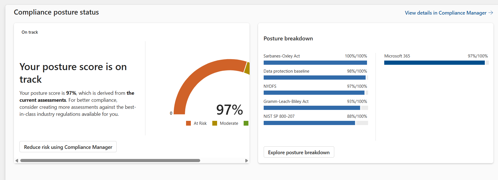

# 🔐 Hybrid Multi-Cloud Zero Trust Architecture with Lean SOC


Welcome to my cybersecurity engineering showcase—a real-world hybrid multi-cloud architecture I designed and implemented using Zero Trust principles integrated with a Lean SOC model across On-Prem, Azure, AWS, and SaaS ecosystem.  The design integrates identity, access control, security monitoring, automation, governance, and secure remote access across cloud, on-premises, and SaaS environments.

---
## [More About Me](https://github.com/Kxanx1538/Portfolio)

---
### 💼 Skills Demonstrated
- Identity and Access Management (IAM) across Azure, AWS, and SaaS
- Zero Trust implementation via Conditional Access, DLP, and device compliance
- Threat Detection and Automated Response via Microsoft Sentinel and custom Python scripts
- hybrid Multi-cloud security architecture and policy-as-code governance

---

## 🌐 Overview

This repository demonstrates how I built and secured a hybrid infrastructure spanning:

- 🏢 On-Premises  
- ☁️ Azure & AWS Cloud  
- 🧩 SaaS Platforms  

The architecture follows Zero Trust principles — ensuring **continuous identity verification**, **least privilege**, and **context-based access** across environments.

---

## 🧩 Architecture Diagram

🔽 Sanitized visual of the high-level architecture:


---
| Label / Acronym      | Meaning                                                                |
| -------------------- | ---------------------------------------------------------------------- |
| **IAM**              | Identity & Access Management – SSO, MFA, SCIM, Conditional Access      |
| **ZTN**              | Zero Trust Network – enforced via VPN and Security Service Edge (SSE) |
| **ZTM**              | Zero Trust Mesh – peer-to-peer identity-aware overlay                  |
| **SIEM**             | Security Information & Event Management (Microsoft Sentinel)           |
| **AMA**              | Azure Monitor Agent – telemetry collection agent for Monitor pipeline  |
| **Azure Arc**        | Resource bridge to onboard and manage hybrid machines in Azure         |

---

## 🧭 Architecture Breakdown & Data Flow

🧩 Architecture Components Explained

This architecture enforces Zero Trust principles across a hybrid, multi-cloud ecosystem, integrating identity, access, monitoring, and secure access controls. Here's how the components interact:

|Zone / Layer                   |Component                            | Description
|-------------------------------|-------------------------------------|-----------------
|Hybrid Identity                |Hybrid Identity Management (IAM)     |Centralized access and identity federation using Microsoft Entra ID (SSO, MFA, SCIM, PIM, Conditional Access), with integrations across SaaS, Azure, AWS, and on-prem environments.
|User Layer                     |👤 User Identity                     |Identities are authenticated and routed through Entra ID using MFA and Conditional Access policies.
|On-Premises                    |AD, Legacy Travel Apps                |Legacy applications and infrastructure reside in a high-trust zone, synchronized with Entra ID using AD Connect and managed under hybrid identity governance.
|Azure Cloud                    |VNet,VMs, Azure blob, Defender XDR, Defender for Cloud  |Azure hosts core infrastructure, UEM, and SIEM; protected via Microsoft Defender, Azure Monitor, and Conditional Access enforcement.enforcement.
|                               |Microsoft 365, Compliance Manager      |Compliance policies and threat monitoring configured in Microsoft Purview.
|AWS Cloud                      |IAM Identity Center, VPC, Security Hub, Security Hub CSPM, CloudWatch, S3  |AWS apps and services reside in a medium trust zone, connected via ZTNA and monitored through AWS CloudTrail and SecurityHub.
|SaaS Layer                     |Travel apps, Email, ITSM, ITAM tools   |SaaS integrations (e.g., Zendesk, Gmail, Zoho) are federated via Entra ID and secured using Secure Web Gateway and VPN access.
|Network Security Tools         |VPN (ZTM), Microsoft Global Secure Access (GSA)-Sesure Service Edge, Suricata|Secure tunnels (VPN, ZTM) and edge access enforcement (GSA) connect environments across trust zones under a Zero Trust Network (ZTN) model.
|Monitoring                     |Sentinel, Site24x7, Azure Monitor, AWS Security Hub, CloudWatch, CloudTrail |Logs and telemetry are collected via AMA, aggregated into Microsoft Sentinel for SIEM, and used to trigger automated alerts and responses.

## 🔄 Data & Trust Flow Summary

- Identity Flow: Authenticated users flow through Entra ID → Conditional Access → SCIM/MFA → Workload Access.

- Traffic Routing: Traffic is routed over VPN and Microsoft GSA for secure connectivity.

- Zone Enforcement:

  - 🔐 High Trust: On-Prem

  - 🔐 Medium Trust: Azure & AWS

  - 🔐 Low Trust: SaaS (external)

- Policy Controls: Conditional Access & RBAC differentiate user access across zones and services.

- Monitoring Layer: Logs from Azure, AWS, SaaS, and VPN are ingested into Microsoft Sentinel for correlation, alerting, and SOAR workflows.

---
## 🛡️ Security Highlights 

- ✅ Hybrid identity and access control with **Microsoft Entra ID**, AWS IdentityCenter, AD
- ✅ Zero Trust Network Access using **Netbird VPN** + **Microsoft Global Secure Access**
- ✅ **Unified Endpoint Management** via Endpoint Central, integrated with Azure AD
- ✅ **SIEM integrations**: Microsoft Sentinel,AWS SecurityHub, AWS CloudWatch, Azure Monitor 
- ✅ **Conditional Access** for trusted zones and role-based access
- ✅ **TLS 1.2**, **disk encryption**, and **VPN-enforced SSO**

---

## 📸 SecOps in Action

| Description                                                    | Screenshot                                               |
|----------------------------------------------------------------|------------------------------------------------          |
|**⏱️ Attack Timeline: Tracing a Multi-Stage, Multi-User Incident Across Cloud Platforms**
This timeline view captures the beginning of my investigation into a “Multi-stage incident involving multiple users”, as automatically surfaced by Microsoft Sentinel’s Fusion engine. The timeline shows how the attack unfolded in distinct phases — starting with suspicious resource deployments and progressing to privileged role assignments across user accounts. This high-level chronology helped me quickly identify lateral movement and escalation patterns. By tracing the flow of alerts over time across Entra ID, Defender for Cloud, and Azure Activity, I was able to prioritize critical events for deeper inspection. This temporal correlation is foundational to Zero Trust enforcement and operational agility in a Lean SOC.  |           |
| **🔍 Alert Deep Dive: Investigating Privileged Role Assignment in a Multi-Stage Threat**
Building on the timeline, I pivoted into focused analysis of a specific alert within the “Multi-stage incident involving multiple users.” This screenshot shows the Microsoft Sentinel Investigation Graph with the Info pane open, centered on a “New User Assigned to Privileged Role” alert. The alert was flagged with the Persistence tactic, and the context revealed unauthorized privilege escalation to a previously unprivileged user — a potential foothold for lateral movement. By correlating entity relationships like IPs, users, and role changes, I validated the severity of the threat and confirmed Zero Trust controls were functioning as intended. This deeper analysis accelerated response prioritization — a critical advantage in Lean SOC operations.   |  |
| **🎯 Conditional Access Policy enforcement(**80.21%** Identity Score)**
This screenshot reflects my implementation and continuous enforcement of Conditional Access policies in Microsoft Entra ID, achieving an 80.21% identity security score. Policies enforced include MFA for privileged roles, blocking legacy authentication, and device-based access restrictions. I aligned most configurations with Microsoft’s Zero Trust recommendations while testing custom policies in Report-Only mode for iterative evaluation. This demonstrates my capability to operationalize adaptive access control using identity posture metrics to assess effectiveness and gaps.| <br>  |
|**🖥️ Device monitoring in Endpoint Central**
 This view illustrates my endpoint vulnerability and patch compliance monitoring across a hybrid fleet using Endpoint Central, integrated with Microsoft Entra ID for device identity governance. It shows how I maintain visibility into OS versions, patch levels, critical vulnerabilities, and compliance status across remote and on-prem devices. My configuration supports automated patch deployment, threat detection, and device health tracking—forming a foundational layer of defense for endpoint hardening.                                                        | |
|**Microsoft Purview Compliance Score (**97%**)**  
This updated screenshot reflects a 97% compliance score in Microsoft Purview Compliance Manager, showcasing my proactive enforcement of security, privacy, and regulatory controls across Microsoft 365 and hybrid cloud environments. I aligned policies and technical configurations with key frameworks including SOX, NYDFS, GLBA, NIST, PCI-DSS, CIS Controls, ISO 27001, and Microsoft’s internal security benchmarks. This score reflects my hands-on work in implementing conditional access, data loss prevention, secure device configurations, auditing policies, and user risk controls — all tracked and measured through Purview’s continuous assessments.   |  |


> All screenshots are real, redacted, and timestamped. No identifying or sensitive data is shown.


---

## 🧰 Tooling Stack examples

| Category             | Tools / Platforms                                                                                      |
|----------------------|--------------------------------------------------------------------------------------------------------|
| Identity & Access    | Microsoft Entra ID, Active Directory, AWS Identity Center, Zoho Identity360, FIM, SCIM, MFA, SSO       |
| Zero Trust Network   | Netbird VPN, Microsoft Global Secure Access (GSA), NSGs, Security Groups, Suricata IDS                 |
| Cloud Infrastructure | Azure (VMs, VNets, NSGs, Azure Monitor), AWS (IAM, EC2, S3, CloudWatch), Terraform                     |
| Endpoint & UEM       | Zoho Endpoint Central (UEM), Microsoft Defender for Endpoint (ATP), integrated with Entra ID           |
| SIEM & Monitoring    | Microsoft Defender XDR, Microsoft Sentinel, Azure Monitor, Site24x7, AWS CloudWatch, Log360            |
| Compliance & Governance   | Microsoft Purview, Microsoft Defender for Cloud, AWS Security Hub, Log360                         |
| DevSecOps & Code Security | GitHub Actions, CodeQL, Dependabot, OWASP ZAP, Burp suite 

---

## 🧱 Zero Trust Pillars & Capabilities

| Zero Trust Pillar        | Implementation & Tools examples                                                                          |
|--------------------------|--------------------------------------------------------------------------------------------------|
| **Identity**             | Microsoft Entra ID, MFA, Conditional Access, Identity360, SCIM, SSO, AWS Identity Center         |
| **Devices**              | Zoho Endpoint Central (UEM), Microsoft Intune (if applicable), Compliance policies via Entra ID  |
| **Network**              | Netbird VPN, Microsoft Global Secure Access (GSA), Azure NSGs, AWS Security Groups               |
| **Applications**         | Conditional Access App Controls, SSO integrations, OAuth Scopes, Application Registrations       |
| **Data**                 | Microsoft Purview (DLP, Insider Risk Mgmt, Compliance Manager), Sensitivity Labels, eDiscovery   |
| **Infrastructure**       | Azure & AWS infrastructure secured via Terraform IaC, Defender for Cloud, AWS Security Hub       |
| **Visibility & Analytics** |Mcrosoft Defender XDR,  Microsoft Sentinel (SIEM), Azure Monitor, Site24x7, AWS CloudWatch, Log360|
| **Automation & Response**| Sentinel SOAR playbooks, Azure Logic Apps, Auto-remediation policies, Compliance Manager insights|


---

## 🧠 Lean SOC in Action: Smart Security Maximizing Security with Minimal Resources

This architecture was designed with a Lean SOC model in mind, optimizing limited resources for maximum security impact. Key strategies:

- ✳️ SIEM/SOAR consolidation using Microsoft Sentinel and Log360
- 🔁 Automation of triage and response workflows using Sentinel playbooks
- 🔍 Unified alert visibility across Azure, AWS, endpoints, and SaaS
- 🎯 Identity-centric telemetry via Entra ID and Conditional Access
- 📊 Use of compliance scoring (Purview) and device hygiene (Endpoint Central) for posture-based alerting
- 🚨 Shadow IT discovery and app control via Defender XDR Cloud Discovery

This enables a smaller security team to perform efficient detection, investigation, and response across a complex hybrid multi-cloud setup.


---
## 🚧 Future Projects: ObsidianWall Platform Initiative (In progress)
**Security Infrastructure-as-Code (SIaC)** — Designing a secure-by-default IaC framework focused on compliant, multi-cloud deployments.

---

## 📁 Repository Contents

```
├── assets/           # Diagrams and redacted screenshots
├── scripts/          # Python automation scripts
├── policies/         # CA, DLP, SOAR & Automation sanitized policy samples
├── README.md        
└── LICENSE
```

---

## 🚀 Why This Project?

This project represents my real-world cybersecurity engineering work:  
✅ Hands-on with modern hybrid security stacks  
✅ Built using Zero Trust principles  
✅ Demonstrates SecOps, IAM, and cloud infrastructure security in action

---

> 🧭 Want to see this in action or talk shop? Let’s connect on [LinkedIn](https://linkedin.com/in/aisha-3136031a0i)!
